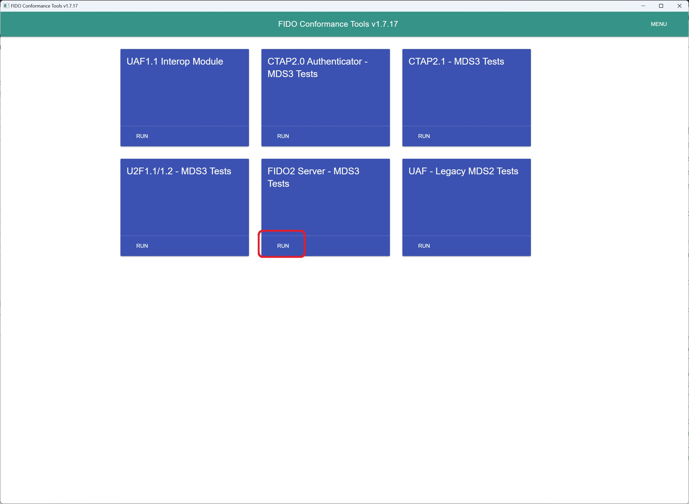
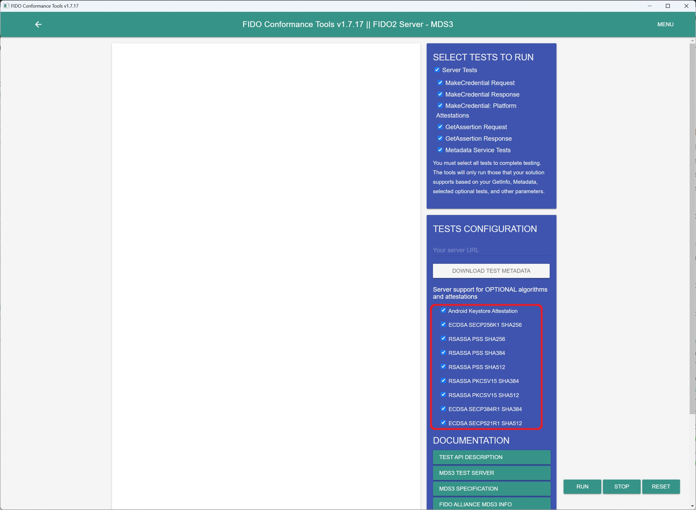
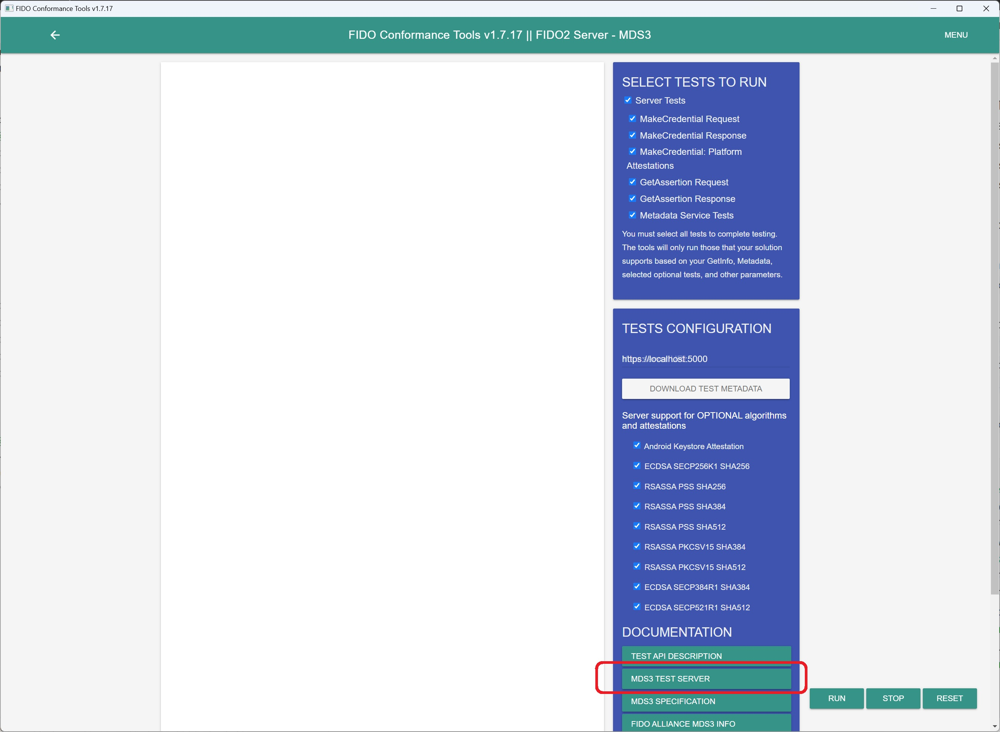
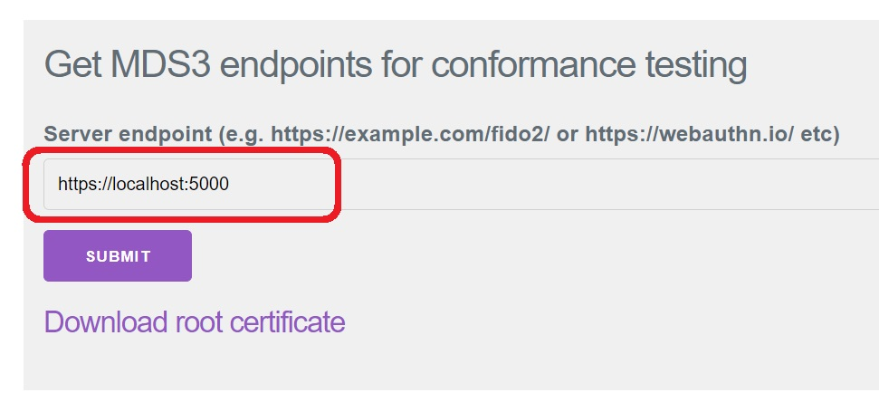
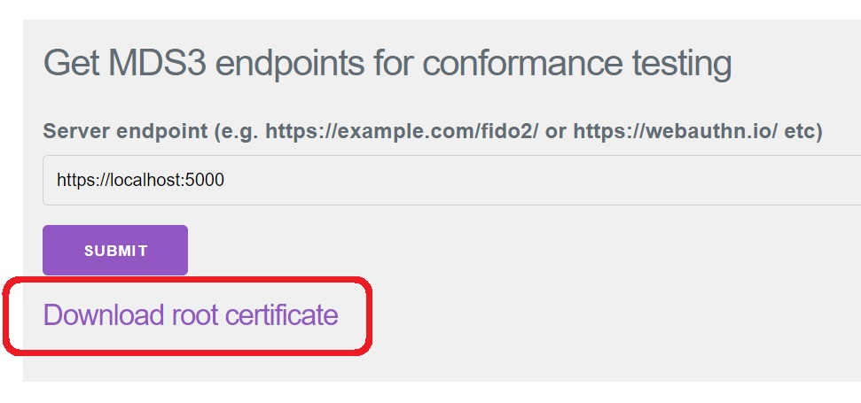
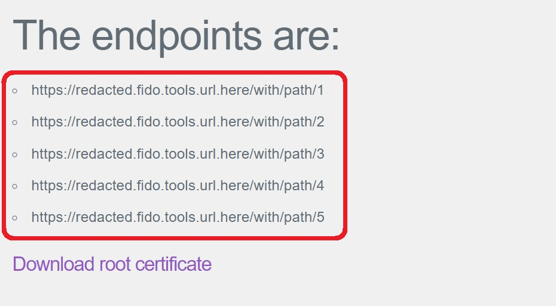
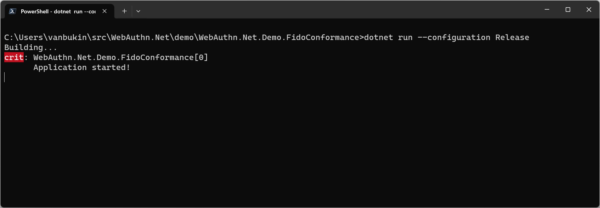
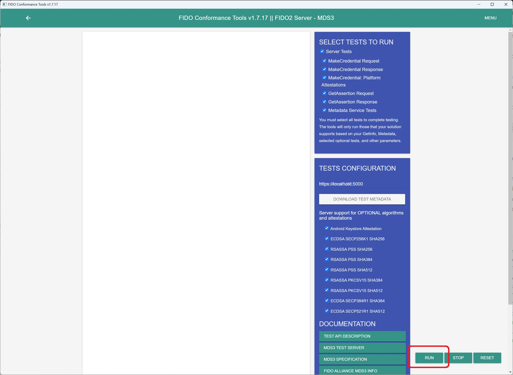
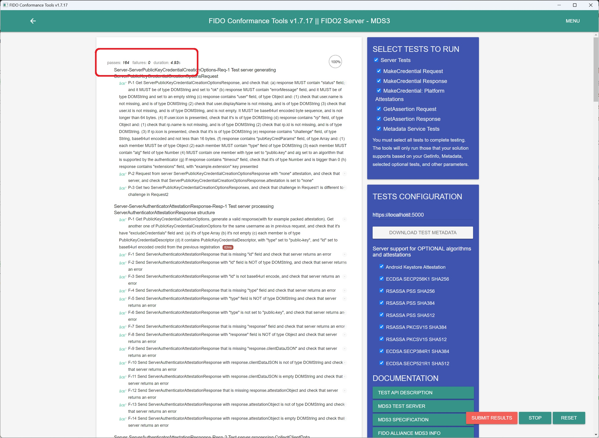

# WebAuthn.Net.Demo.FidoConformance

This project contains a demo application designed for passing the [FIDO conformance test](https://fidoalliance.org/certification/functional-certification/conformance/).

## How to access the FIDO Conformance Tools

1. On the FIDO Alliance website, open the [Conformance Self‐Validation Testing](https://fidoalliance.org/certification/functional-certification/conformance/) page
2. Find the link to the registration form on the specified page and open it.
3. Fill out the form, specifying that you need access to FIDO2.
4. Wait for an email with further instructions.
5. Download the latest version of the Certification Conformance Testing Tools.

## How to run the FIDO Conformance test

### Prerequisites

These steps need to be performed only if you have not done them before.

1. Install .NET SDK versions [6.0.422+](https://dotnet.microsoft.com/en-us/download/dotnet/6.0) and [8.0.205+](https://dotnet.microsoft.com/en-us/download/dotnet/8.0).
2. [Trust the ASP.NET Core HTTPS development certificate](https://learn.microsoft.com/en-us/aspnet/core/security/enforcing-ssl?view=aspnetcore-8.0&tabs=visual-studio%2Clinux-ubuntu#trust-the-aspnet-core-https-development-certificate-on-windows-and-macos)

### Starting the FIDO Conformance test

1. Launch the FIDO Conformance Tools
2. From the available test options, select `"FIDO2 Server - MDS3 Tests"`
   
3. In the `"SELECT TESTS TO RUN"` section, enable all available options
   
4. In the `"TESTS CONFIGURATION"` section, also enable all available options
   
5. In the `"TESTS CONFIGURATION"` section, specify the application URL (by default `https://localhost:5000`)
   
6. Download the test metadata by clicking on the `"Download test metadata"` button.
   
7. In the archive with test metadata (`metadata.zip`), there will be a `metadataStatements` folder containing json files. Move them to the `demo/WebAuthn.Net.Demo.FidoConformance/ConformanceMetadata/MetadataStatements` folder.
8. Click the `"MDS3 test server"` button.
   
9. On the page that opens, in the `"Server endpoint"` field, enter the application address (by default `https://localhost:5000`).
   
10. Click the `"Download root certificate"` button. Place the downloaded certificate (`MDS3ROOT.crt`) in the `demo/WebAuthn.Net.Demo.FidoConformance/ConformanceMetadata/RootCertificate` folder.
    
11. Click the `"SUBMIT"` button, after which you will receive 5 links to different files. Download them and place them in the `demo/WebAuthn.Net.Demo.FidoConformance/ConformanceMetadata/Jwt` folder.
    
12. Execute the instructions from the section ["Starting the test application"](#starting-the-test-application).
    
13. Press the `"RUN"` button.
    
14. All tests should complete successfully.
    

### Starting the test application

1. Navigate to the `demo/WebAuthn.Net.Demo.FidoConformance` directory.
2. Execute the following command:
   ```shell
   dotnet run --configuration Release
   ```
3. You should see the logged message "Application started!" in the console.
